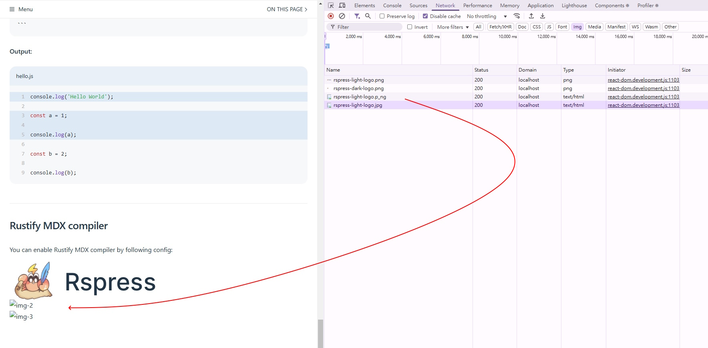
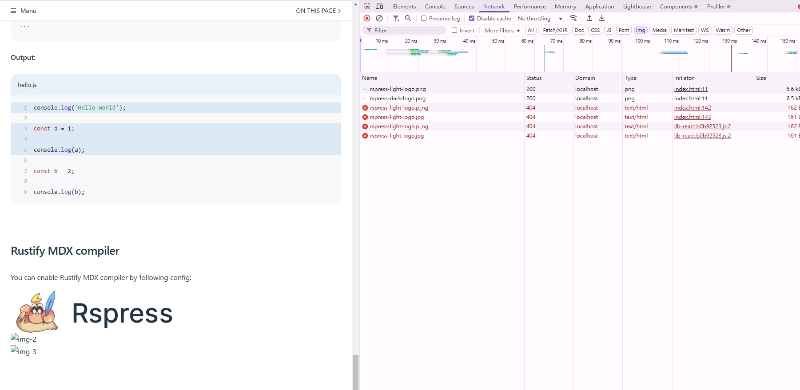

# Rspress website

## Setup

## step 1

```bash
pnpm create rspress@latest # get "rspress": "^1.40.2"
```

## step 2

Ensure the bug exists in the latest version


```bash
pnpm up -L
```

get 

```json
{
  "dependencies": {
    "rspress": "^1.41.2"
  },
  "devDependencies": {
    "@types/node": "^22.13.1"
  }
}
```

## step 3

edit ["docs/guide/index.md"](docs/guide/index.md)

```diff
# line 211
+ 
+ 
+ 
```

Adding wrong path

## dev mode

```bash
pnpm run dev
```


> dev mode show `200` OK

## preview mode

```bash
pnpm run build
pnpm run preview
```


> preview mode status `404` not find

### last

I want to reduce dx of the differences between dev and preview modes.
In the example code, I chose the `img` tag because the demonstration effect is obvious.

For other resources, or when the images are smaller (as shown below) 
/ or when the image is temporarily obscured by something else, 
I think it would be better if there were clear warnings in Chrome DevTools. 

Note: In projects opened directly with `rsbuild`, if the image requests in dev mode are incorrect, the network panel will show a `404` error.

```tsx
// import { Badge } from '@theme';

<Badge type="tip">
  
  <span>Rspress</span>
</Badge>

<Badge type="tip">
  
  <span>Rspress</span>
</Badge>
```
